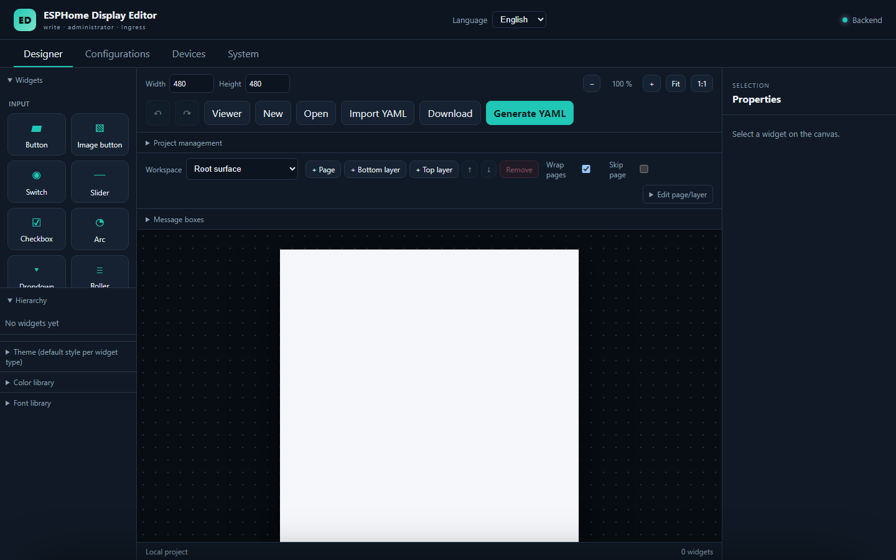
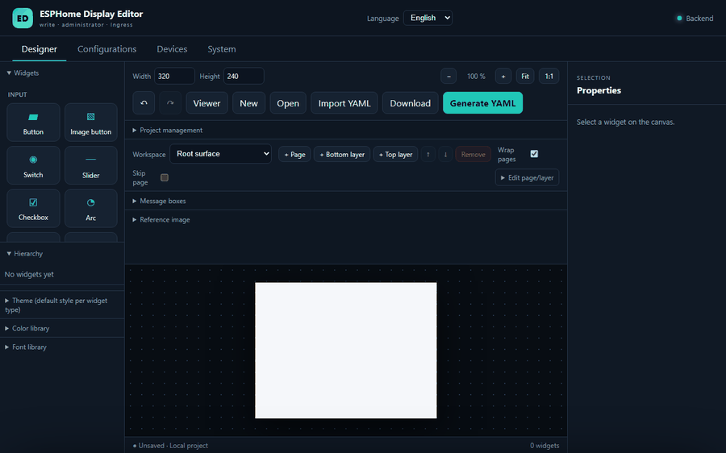
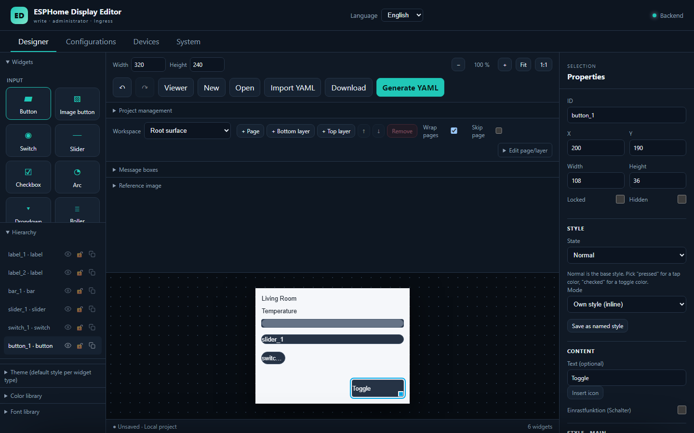
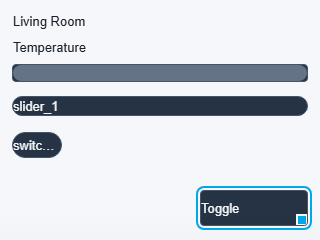
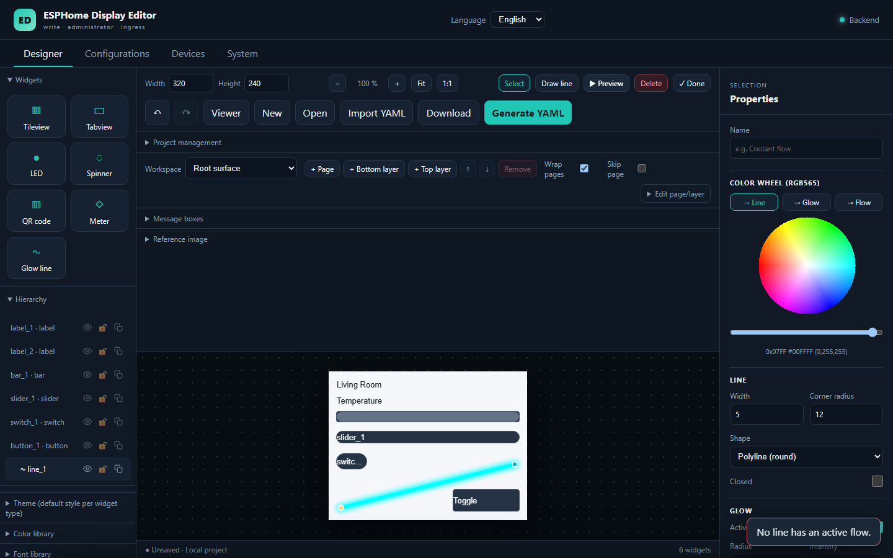
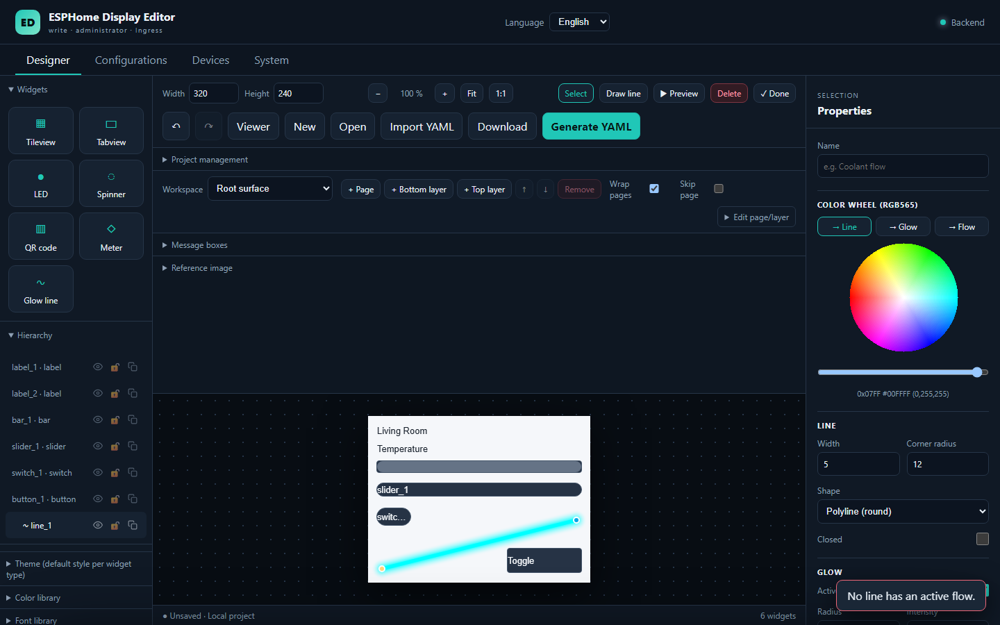
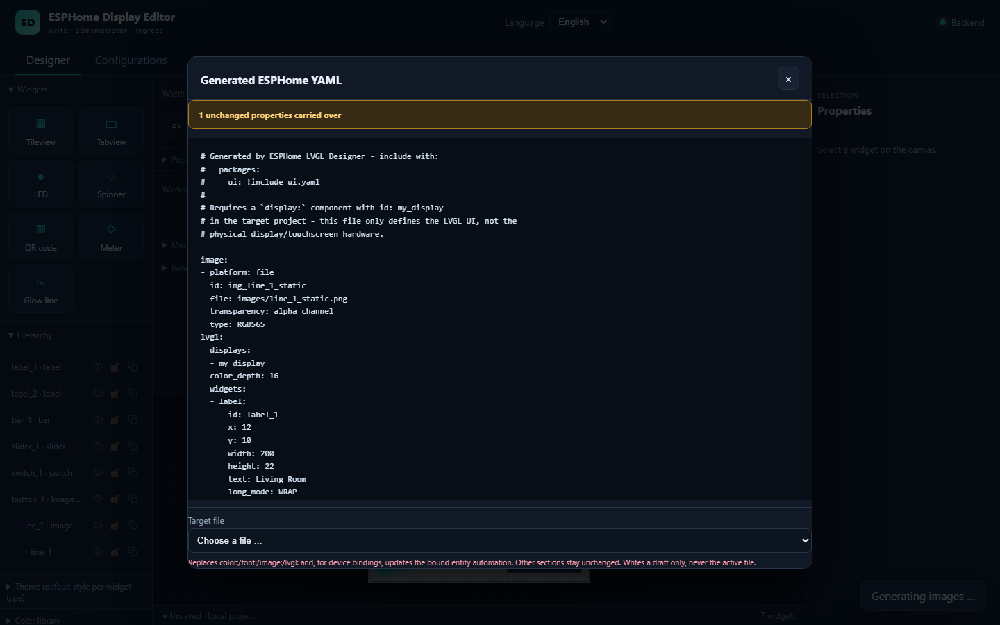
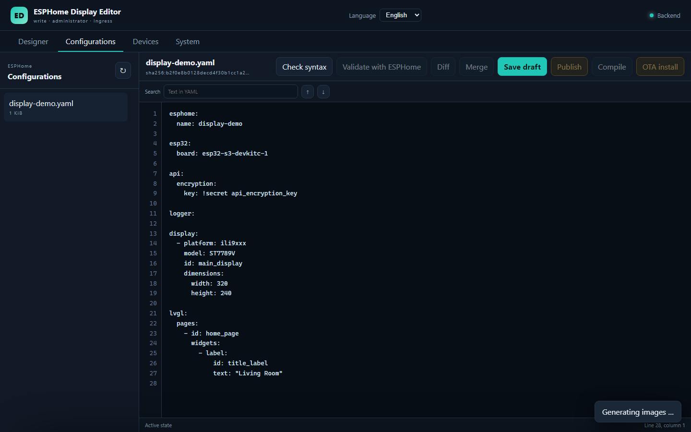
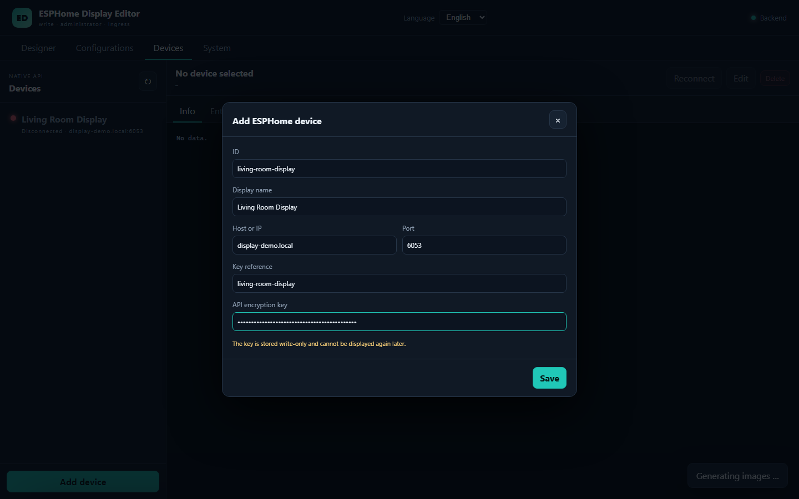
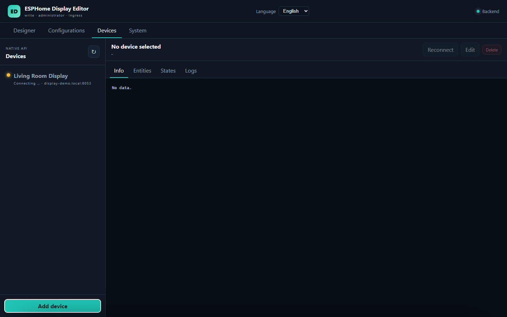

# ESPHome Display Editor App Repository

Home Assistant App repository for **ESPHome Display Editor**: a visual LVGL
designer and controlled editor for ESPHome configuration files. It runs
entirely inside Home Assistant as an Ingress-only add-on, so no extra port is
exposed on the network, and lets you build LVGL display layouts for ESP32
devices by dragging and arranging widgets on a canvas instead of hand-writing
YAML.



## Features

- **Drag-and-drop LVGL designer** — place, resize, nest and reorder widgets
  (labels, buttons, images, sliders, containers, ...) on a canvas that
  mirrors the real display resolution, with undo/redo, grid and flex layout
  support, and live property editing.
- **GlowLine animated flow lines** — draw glowing, animated lines directly on
  the canvas as a dedicated widget type. Originally built for visualizing
  **energy flow** (e.g. power, coolant or data flow between components on a
  dashboard), a GlowLine is a filleted polyline or Catmull-Rom spline with a
  multi-pass glow and moving flow markers (arrows or dashes) that show
  direction and motion. Lines can be nested inside containers, locked,
  hidden, and quantised through an RGB565 colour wheel that shows exactly
  what an actual display will reproduce. On YAML generation, the animation
  can be baked into a seamlessly looping, RGB565-quantised PNG sequence and
  wired up as a matching `image` + `animimg` widget pair automatically — no
  manual YAML required.
- **Safe, controlled YAML editing** — configuration drafts are validated and
  diffed before anything is written back, so the designer never silently
  overwrites your active ESPHome files.
- **Persistent designer projects** with per-user roles, so multiple Home
  Assistant users can work on separate or shared display projects.
- **Live entity bindings and a read-only Viewer** — map labels, sliders,
  bars, arcs and switches to Home Assistant/ESPHome entities and preview a
  running dashboard, plus optional bidirectional device bindings that are
  compiled straight into the generated YAML.
- **Encrypted, read-only device monitoring** via the ESPHome Native API:
  device info, entities, current states and logs are visible in the
  **Devices** view (device commands remain intentionally disabled).
- **Security by design** — Ingress-only request enforcement and API rate
  limits, with configurable access levels ranging from fully read-only to
  full write access with an optional Device Builder integration.

## See it in action

Adding widgets to a small dashboard layout and generating the ESPHome YAML
for it, end to end in the Designer:



### The LVGL Designer

Drag widgets from the palette, position and resize them numerically or on
the canvas, and inspect the live widget tree in the hierarchy panel on the
left.



Every widget exposes its full ESPHome/LVGL property set — geometry, style,
state and content — in the properties panel on the right.



### GlowLine animated flow lines

Draw a line by adding it from the palette and dragging its endpoint handles
into place; an RGB565 colour wheel lets you tune the line, glow and flow
colours to exactly what the target display will reproduce.





### Generating ESPHome YAML

"Generate YAML" produces ready-to-include LVGL configuration, with a target
file picker and a clear warning about which sections a merge will touch.



### Safe configuration editing

The Configurations view lists your active ESPHome files and opens them in a
read-only-by-default YAML workspace with search, syntax/ESPHome validation,
diffing, merging and a controlled draft → publish → compile → OTA install
flow.



### Encrypted device monitoring

Add an ESPHome device with its Native API host, port and encryption key to
get read-only live info, entities, states and logs — no plaintext or
legacy-password fallback, and no device commands are ever sent.





## Install in Home Assistant

1. Open **Settings → Apps → App store**.
2. Open the repository menu and add:
   `https://github.com/GitNik1/esphome-displayeditor-app`
3. Install **ESPHome Display Editor**.
4. Start the app and open its Ingress web interface.

Home Assistant detects updates when the app version in
`esphome_displayeditor/config.yaml` is increased and the repository is
refreshed.

## Development status

The current milestone provides the Home Assistant app container, stable health
and capability endpoints, safe ESPHome YAML draft handling, persistent visual
designer projects, per-user roles, Ingress-only request enforcement, API rate
limits, encrypted read-only ESPHome Native API device monitoring, and a
web-native port of the model and YAML export engine from
`esphome-lvgl-designer`. Device information, entities, current states and logs
are available in the Devices view; device commands remain disabled.

See [app documentation](esphome_displayeditor/DOCS.md) for configuration and
security details.

## Development checks

Install the development dependencies and run the same checks used by CI:

```bash
cd esphome_displayeditor
python -m pip install -c constraints.txt -r requirements-dev.txt
./scripts/check.sh
```

On Windows, use `scripts\check.ps1` from PowerShell.

The check currently enforces correctness-focused Ruff rules. Repository-wide
format enforcement will be enabled separately after the existing Python files
have been normalized in one dedicated change. Backend coverage is reported and
must remain at or above 83 percent. Node.js 22 is required for the frontend
unit tests.

`requirements.txt` and `requirements-dev.txt` contain the direct dependency
ranges. `constraints.txt` pins the complete Python 3.13 dependency graph for
local development, CI and the production image. After changing either input,
regenerate it from the app directory with:

```bash
uv pip compile --python-version 3.13 --universal \
  --no-emit-index-url --output-file constraints.txt requirements-dev.txt
```

### Local container

With Docker Compose installed, build and start the development container from
the repository root:

```bash
docker compose up --build -d
docker compose ps
```

The editor is available at `http://localhost:8099`. Set
`ESPHOME_EDITOR_PORT` before starting Compose to use another host port. Follow
logs with `docker compose logs -f app` and stop the environment with
`docker compose down`. The named `app-data` volume intentionally survives a
normal stop; use `docker compose down --volumes` only when its local drafts and
settings may be deleted.

The Compose environment enables anonymous writes and direct access for local
development only. Production continues to use Home Assistant Ingress and the
app configuration from `esphome_displayeditor/config.yaml`.

## License

MIT. The designer engine is derived from the MIT-licensed
`esphome-lvgl-designer` project by Niklaus Riedle.
